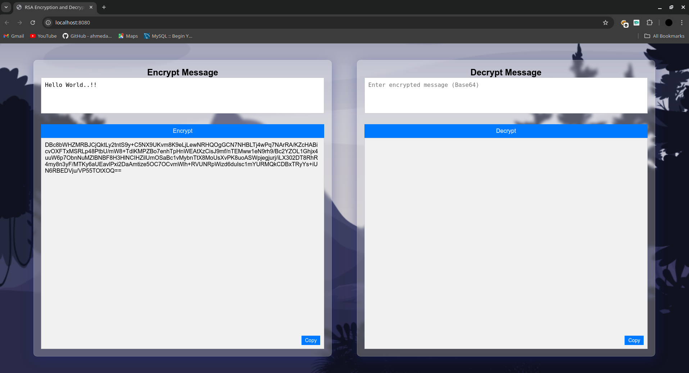
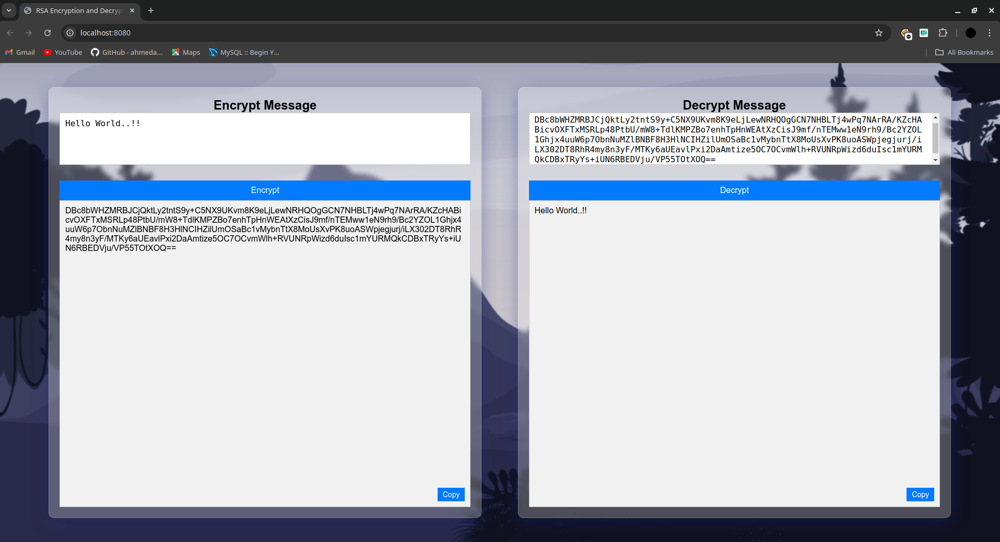

# Text Encryption

## Overview

Text-Encryption is a web application designed for RSA encryption and decryption using Golang. It allows users to securely encrypt and decrypt messages via a web interface. The backend handles cryptographic operations using RSA keys, and messages are encoded using Base64 to ensure compatibility.making the encryption process more user-friendly and accessible.

## Features

- **RSA Encryption/Decryption**: Utilizes 2048-bit RSA keys for secure message encryption and decryption.
- **Base64 Encoding**: Encodes messages in Base64 for transmission
- **RESTful API**: Provides two main endpoints for encryption and decryption.
  - `/encrypt`: Encrypts a provided message.
  - `/decrypt`: Decrypts an encrypted message.
- **Docker Support**: A Docker container setup simplifies the deployment process.


## Setup Instructions

### Prerequisites

- **Golang**
- **Docker** (Optional)

### Running the Application

#### Running Directly with Golang

1. Clone the repository:
   ```bash
   git clone https://github.com/d1v45/Text-Encryption.git
   cd Text-Encryption
   ```

2. Run the application:
   ```bash
   go run main.go
   ```

3. Open the application in your browser:
   ```
   http://localhost:8080
   ```

#### Using Docker

1. Clone the repository:
   ```bash
   git clone https://github.com/d1v45/Text-Encryption.git
   cd Text-Encryption
   ```

2. Build and run the Docker container:
   ```bash
   docker build -t Text-Encryption .
   docker run -p 8080:8080 Text-Encryption
   ```

3. Access the application in your browser:
   ```
   http://localhost:8080
   ```

### Usage

- **Encrypt a Message**: Type a message in the "Encrypt Message" box, and click "Encrypt." The encrypted message will be displayed below.
- **Decrypt a Message**: Paste an encrypted Base64 string into the "Decrypt Message" box, and click "Decrypt" to see the original message.

### API Endpoints

- `POST /encrypt`: Encrypts a plaintext message.
  - Request:
    ```json
    {
      "message": "Your plaintext message"
    }
    ```
  - Response:
    ```json
    {
      "encrypted_message": "Encrypted Base64 string"
    }
    ```

- `POST /decrypt`: Decrypts an encrypted Base64 message.
  - Request:
    ```json
    {
      "encrypted_message": "Base64 string"
    }
    ```
  - Response:
    ```json
    {
      "decrypted_message": "Original plaintext message"
    }
    ```


## Example

Below are example screenshots showing the Safe-Website application interface for encryption and decryption.

### Encryption Example



### Decryption Example



## License

This project is licensed under the MIT License.
